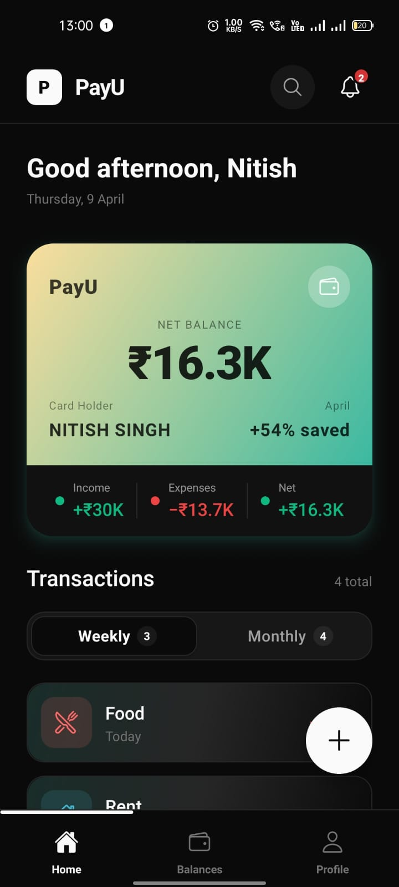
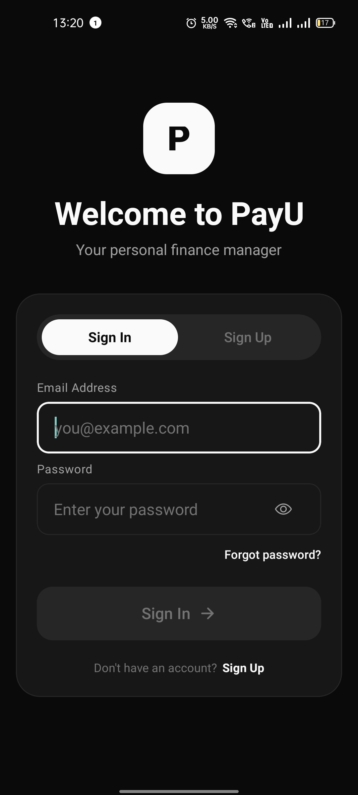
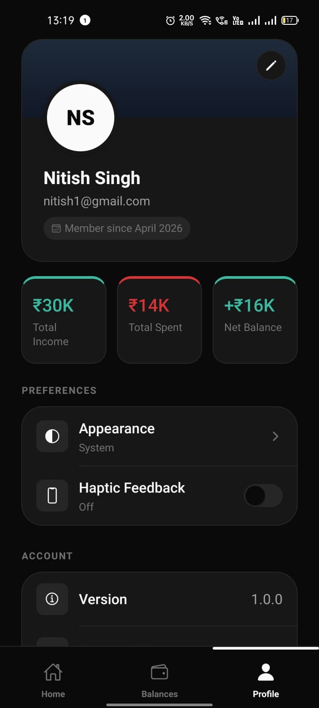
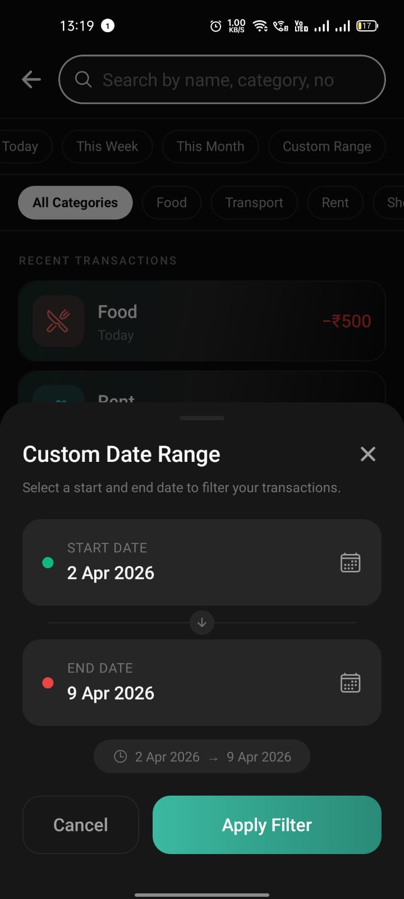
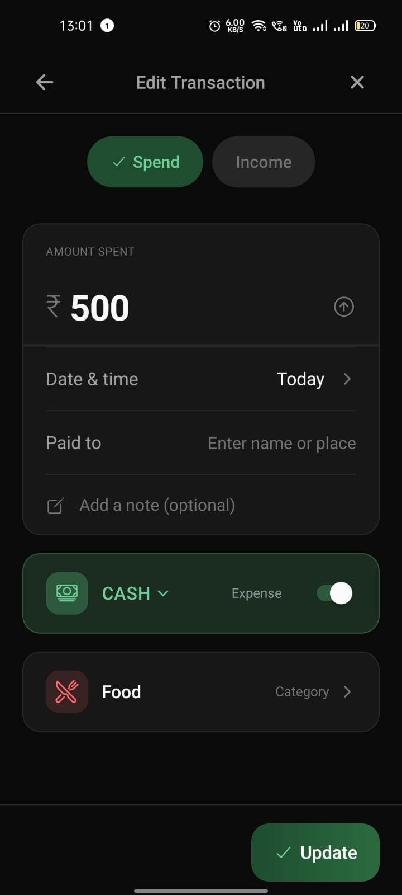
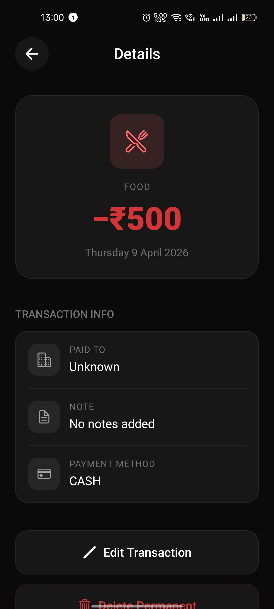
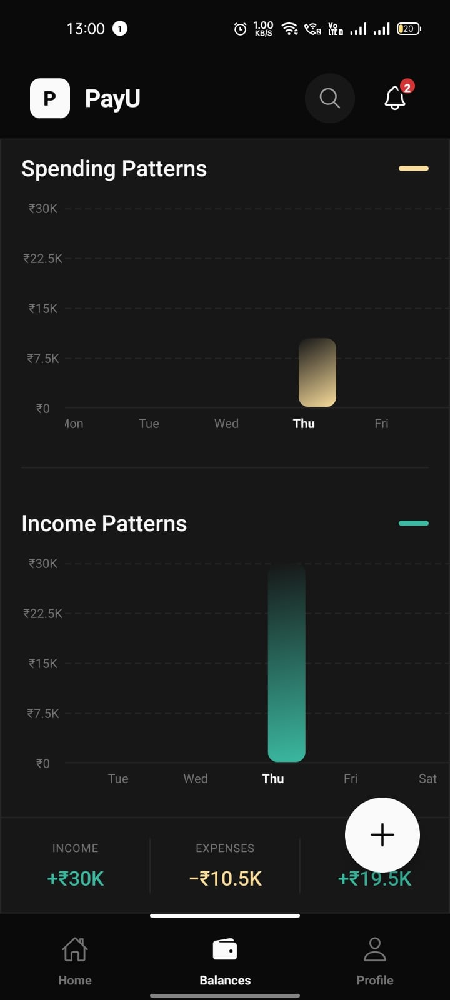
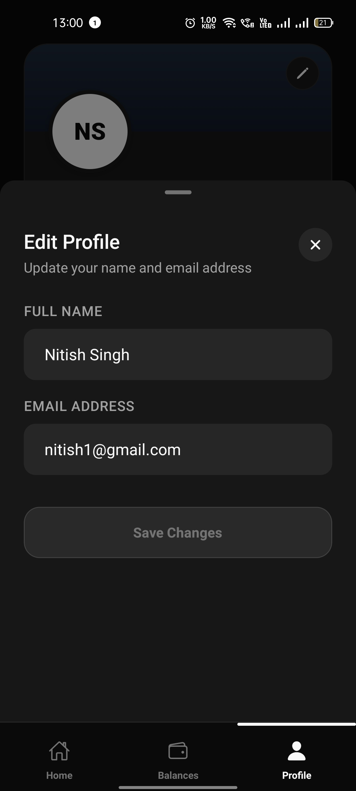
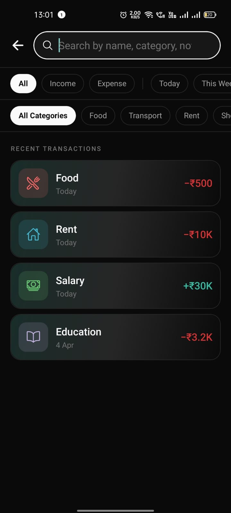

# Payu - Local-First Personal Finance App

Payu is a premium, high-performance personal finance management application built with Expo and React Native. It features a modern, modular architecture and a local-first approach for instantaneous performance and full offline support.

##  Key Features

- **Local-First Architecture**: Powered by SQLite for ultra-fast data access and seamless offline capabilities.
- **Premium UI/UX**:
  - **Modular Search**: Highly optimized search screen with **300ms debouncing** to prevent UI flickering and database strain.
  - **Modular Transaction Entry**: Optimized "Add Transaction" flow with logic decoupled from UI into clean, maintainable components.
  - **Premium Feedback**: Integrated `expo-haptics` for tactile interactive feedback.
  - **Skeleton Loading**: Smooth shimmering loaders during initial data fetch to provide a polished startup experience.
- **Analytics & Insights**: Interactive spending and income patterns driven by `react-native-gifted-charts`.
- **Theme System**: Full support for System, Light, and Dark modes with a curated, harmonious color palette.
- **Transaction Details**: Comprehensive history view with filtering by weekly, monthly, or custom date ranges.

## 🛠️ Setup Instructions

### Prerequisites
- Node.js (v18 or later)
- Android Studio (for Android Emulator) or Xcode (for iOS Simulator).
- Physical device with USB debugging enabled (optional).

### Installation

1. **Clone the repository**:
   ```bash
   git clone git@github.com:nitish-singh07/takeUforwardAssignment-.git
   cd Payu
   ```

2. **Install dependencies**:
   ```bash
   npm install
   ```

3. **Start the application (Native Build Required)**:
   > [!IMPORTANT]
   > This project uses **`expo-sqlite`**, which requires native code integration. You **cannot** use the standard Expo Go app from the Play Store/App Store. You must run the project using a native development build.

   - To run on **Android**:
     ```bash
     npx expo run:android
     ```
   - To run on **iOS**:
     ```bash
     npx expo run:ios
     ```

## 📸 App Screenshots

| Home | Auth Screen | Profile |
| :---: | :---: | :---: |
|  |  |  |

| Custom Range  | Add Transaction | Details |
| :---: | :---: | :---: |
|  |  |  |

| Chart | Edit Profile | Search & Filters |
| :---: | :---: | :---: |
|  |  |  |

## 🏗️ Architecture

The project follows a modular pattern designed for scalability and maintainability:

- **Logic Separation**: Complex business rules are extracted into custom hooks (e.g., `useTransactionSearch`, `useAddTransactionForm`).
- **Modular Components**: UI elements are deconstructed into feature-specific folders (e.g., `src/components/search/`).
- **State Management**: Orchestrated using **Zustand** for lightweight and reactive global state.

## 💾 Database (SQLite)

Payu uses **`expo-sqlite`** as its core data engine. 

- **Why Native Builds?**: Unlike standard Expo apps, SQLite interacts directly with the device's local file system via native bindings. By using `npx expo run:android`, the project creates a development build that includes these necessary native libraries.
- **Local Persistence**: All transaction data is stored locally in a relational database. This ensures:
  - **Zero Latency**: Instant data retrieval without network overhead.
  - **Privacy**: Your financial data never leaves your device.
  - **Reliability**: Works perfectly in flight mode or areas with poor connectivity.
